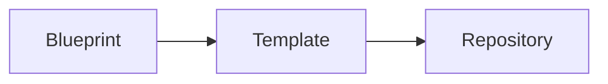

# Forge Documentation Guide

- **Document type:** Guide
- **Status:** Approved
- **Version:** 1.0.0
- **Author:** @thapelomagqzana
- **Created:** 2026-10-09
- **Last Updated:** 2026-10-09
- **Supersedes:** —
- **Superseded by:** —

---

## 1. Purpose

This guide defines how documentation is written, structured, versioned,
and maintained across the Forge project. It is the contract that every
Forge document must satisfy.

Forge's own premise is that engineering standards should be explicit
and verifiable. This guide applies that same principle to Forge's
documentation.

---

## 2. Scope

**In scope:**

- Markdown writing conventions
- Document type taxonomy
- Required document structure
- Heading rules
- Terminology rules
- Diagram conventions
- Decision record format
- Document versioning
- Document ownership
- Review and approval process
- Requirement identifier scheme

**Out of scope:**

- Code style (see future `docs/code-style.md`, Phase 2+)
- Commit message conventions (see future `CONTRIBUTING.md`)
- Release process (see future `docs/release-process.md`)
- CI/CD configuration (see `.github/workflows/`)

---

## 3. Document Types

Every Forge document belongs to exactly one type. The type determines
location, required sections, and review process.

| Type | Location | Purpose | Required Sections |
|------|----------|---------|-------------------|
| **Specification** | `docs/*-spec.md` | Defines a Forge concept or contract | Purpose, Scope, Model, Examples, Open Questions, Status |
| **Model** | `docs/*-model.md` | Defines a conceptual or domain model | Purpose, Entities, Relationships, Invariants |
| **Guide** | `docs/*-guide.md` | Explains how to do something | Purpose, Scope, Steps, Examples |
| **Report** | `docs/*-report.md` | Records the outcome of a phase or investigation | Purpose, Summary, Evidence, Decisions, Open Questions |
| **Research** | `docs/research/*.md` | Captures raw evidence from interviews or studies | Purpose, Method, Findings, Evidence |
| **Decision** | `docs/decisions/ADR-*.md` | Records an architectural or product decision | Status, Context, Options, Decision, Consequences |
| **Register** | `docs/*-register.md` | Maintains an indexed list of identifiers | Purpose, Index Tables |
| **Template** | `docs/templates/*.md` | Reusable scaffolds for other documents | Template content |

A document that does not fit any type must justify a new type in an ADR.

---

## 4. Required Document Header

Every Forge document begins with a **metadata block** in this exact form:

```text
# [Document Title]

**Document type:** Specification | Model | Guide | Report | Research | Decision | Register
**Status:** Draft | Review | Approved | Superseded | Archived
**Version:** MAJOR.MINOR.PATCH
**Author:** [name or role]
**Created:** YYYY-MM-DD
**Last Updated:** YYYY-MM-DD
**Supersedes:** [document path or —]
**Superseded by:** [document path or —]
```

Fields must not be omitted. Use `—` (em dash) for empty values.

---

## 5. Heading Rules

### 5.1 Hierarchy

- **H1 (`#`)** — Document title only. Exactly one per document.
- **H2 (`##`)** — Major sections (Purpose, Scope, etc.)
- **H3 (`###`)** — Subsections within a major section
- **H4 (`####`)** — Rare. Use only when H3 is insufficient.
- **H5, H6** — Not permitted. If you need them, restructure.

### 5.2 Section Numbering

H2 sections are numbered (`## 1. Purpose`, `## 2. Scope`).
H3 and below are not numbered — they use descriptive titles.

### 5.3 Title Case

- H1 uses Title Case
- H2 uses Title Case
- H3 and below use Sentence case

**Correct:**

```text
# Blueprint Specification
## 1. Purpose
### Required fields
```

**Incorrect:**

```text
# blueprint specification
## purpose
### Required Fields
```

### 5.4 No Skipped Levels

Do not jump from H2 to H4. Every heading level must appear in sequence.

---

## 6. Markdown Conventions

### 6.1 Line Length

Wrap prose at **80 characters** where practical. This keeps documents
readable in terminals and diff-friendly in Git.

Tables, code blocks, and long URLs are exempt.

### 6.2 Lists

- Use `-` for unordered lists (never `*`)
- Use `1.` for ordered lists (never `1)`)
- Nested lists indent by 2 spaces

### 6.3 Emphasis

- **Bold** for key terms at first definition and for UI labels
- *Italic* for emphasis and for document titles
- `Backticks` for code, file paths, commands, identifiers, and field names

Do not use bold or italic for decorative purposes.

### 6.4 Code Blocks

Always specify the language:

```go
func Execute() int { ... }
```

```yaml
project:
  name: payments-api
```

```bash
forge new payments-api
```

For plain text or diagrams:

```text
CLI → Application → Domain
```

### 6.5 Tables

Tables use left-aligned columns by default. Header row is required.

```text
| Field | Type | Required |
|-------|------|----------|
| name | string | yes |
| type | enum | yes |
```

### 6.6 Block Quotes

Use block quotes for:

- Direct quotations from research participants
- Explicit warnings

```text
> **Warning:** This operation mutates the filesystem.
```

Do not use block quotes for ordinary emphasis.

### 6.7 Links

- Internal links use **relative paths**: `[Blueprint spec](./blueprint-spec.md)`
- External links use full URLs
- Anchor links are permitted but discouraged (they break on rename)

### 6.8 File Paths

Always wrap paths in backticks:

```text
The configuration lives at `forge.yaml`.
```

Never link to a path that does not exist. If a document references
`docs/foo.md`, that file must exist or the reference must be marked
as *(planned)*.

### 6.9 Trailing Whitespace

No trailing whitespace on any line. Two trailing spaces (Markdown
line break) are not permitted — use a blank line instead.

### 6.10 File Ending

Every document ends with a single newline. No blank lines at end of file.

---

## 7. Terminology Rules

### 7.1 Canonical Vocabulary

The following terms have precise, project-wide meanings. They must be
used consistently and never redefined.

| Term | Definition |
|------|------------|
| **Foundation** | The declared engineering state of a repository |
| **Blueprint** | The declarative description of what a project should be |
| **Template** | An implementation mechanism that materialises a blueprint into files |
| **Component** | A composable engineering capability that can be added to or removed from a foundation |
| **Policy** | A required or optional engineering rule applied to a repository |
| **Renderer** | The subsystem that transforms a specification into file content |
| **Validator** | The subsystem that compares expected state to actual state |
| **Drift** | Divergence between the expected foundation and the actual repository |
| **Expected state** | What the foundation declares should be true |
| **Actual state** | What the repository currently contains |
| **Finding** | A single result produced by validation or drift detection |
| **Evidence** | Observable facts supporting a finding (file existence, content, hash) |
| **Provenance** | The origin of a piece of information (which blueprint, which policy, which version) |
| **Drift event** | A recorded change in drift status over time |

### 7.2 Adding New Terms

Before introducing a new canonical term:

1. Add it to this table
2. Justify the term in the document that first uses it
3. If the term is architectural, record an ADR

### 7.3 Terminology Anti-Patterns

Do not use these synonyms — they are ambiguous:

| Ambiguous term | Use instead |
|----------------|-------------|
| "template" (when meaning blueprint) | **blueprint** |
| "generator" | **renderer** (technical) or **Forge** (product) |
| "schema" (when meaning model) | **model** for domain concepts, **schema** for wire formats |
| "config" | **configuration** in prose, `config` only in code and paths |
| "project" (when meaning repository) | **repository** for the Git repo, **project** for the abstract concept |

### 7.4 Capitalisation

- Forge (always capitalised)
- ADR (always uppercase)
- Requirement prefixes always uppercase: `FR-`, `NFR-`, `SEC-`, `UX-`, `MKT-`, `ADR-`
- Command names lowercase: `forge new`, `forge check`

### 7.5 Command Presentation

Command names appear in one of three forms:

- **Inline:** `forge new` — inside prose
- **Block:** inside a `bash` code block — for multi-line examples
- **Reference:** `forge <command> --help` — for syntax specification

Do not mix forms within a single paragraph.

---

## 8. Requirement Identifiers

Requirements are assigned IDs in the format:

```text
[PREFIX]-[CATEGORY]-[NNN]
```

**Prefixes:**

| Prefix | Meaning |
|--------|---------|
| `FR-` | Functional Requirement |
| `NFR-` | Non-functional Requirement |
| `SEC-` | Security Requirement |
| `UX-` | User Experience Requirement |
| `MKT-` | Market Finding |

**Categories:** `CLI`, `CORE`, `BLUEPRINT`, `TEMPLATE`, `COMPONENT`,
`POLICY`, `UPDATE`, `REGISTRY`, `PERF`, `COMPAT`.

**Rules:**

- IDs are immutable once assigned
- Retired IDs are never reused
- Every requirement appears in `docs/requirements-register.md`
- Documents reference requirements by ID, not by description

**Example:**

```text
FR-CORE-001: Forge must support a declarative Blueprint.
```

---

## 9. Diagram Conventions

### 9.1 Priority Order

Prefer diagrams in this order:

1. **ASCII diagrams** — portable, diff-friendly, render everywhere
2. **Mermaid** — when ASCII cannot express the relationship
3. **External images** — only when the above are impossible

### 9.2 ASCII Diagrams

Use box-drawing characters:

```text
┌──────────────┐
│   Blueprint  │
└───────┬──────┘
        │
        ▼
┌──────────────┐
│  Template    │
└──────────────┘
```

Rules:

- Use `─│┌┐└┘├┤┬┴┼` and `→ ← ↑ ↓ ▼ ▲`
- Do not use `+-|` for box borders unless expressing a diff
- Every diagram must be readable in a 100-character-wide terminal
- Diagrams must not rely on colour

### 9.3 Mermaid

Use Mermaid only for flowcharts and sequence diagrams. Fence with `mermaid`:



### 9.4 Diagram Captions

Every diagram must be preceded by a one-sentence description:

```text
The following diagram shows the resolution flow:

┌──────────────┐
│   Blueprint  │
...
```

### 9.5 Diff Diagrams

When expressing a change, prefix lines with `+`, `-`, `~`, or `=`:

```text
+ .github/workflows/security.yml
- obsolete.yml
~ pyproject.toml
= src/main.py
```

---

## 10. Decision Record Format

Architectural and product decisions live in `docs/decisions/`.

**File naming:** `ADR-NNN-short-title.md`

Examples:

- `ADR-001-forge-as-foundation-manager.md`
- `ADR-002-blueprint-as-source-of-truth.md`

**Required structure:**

```text
# ADR-NNN: [Decision Title]

**Status:** Proposed | Accepted | Superseded by ADR-NNN | Deprecated
**Date:** YYYY-MM-DD
**Deciders:** [names or roles]

## Context

What situation requires a decision? What forces are at play?

## Options Considered

### Option A — [Name]
- Description
- Pros
- Cons

### Option B — [Name]
- Description
- Pros
- Cons

## Decision

The chosen option, stated plainly, with reasoning.

## Consequences

### Positive
- ...

### Negative
- ...

### Neutral
- ...

## Related Requirements

- FR-xxx
- SEC-xxx

## Related ADRs

- ADR-xxx
```

**Rules:**

- ADRs are immutable
- When a decision changes, write a new ADR that supersedes the old one
- The old ADR's status becomes `Superseded by ADR-NNN`
- ADR numbers are never reused
- ADRs use the same metadata discipline as other documents

---

## 11. Document Versioning

### 11.1 Document Version vs. Document Status

These are independent:

- **Version** (`1.0.0`) — a versioned revision of the document
- **Status** (`Draft`, `Review`, `Approved`, `Superseded`, `Archived`)

A document can be `Version: 2.1.0, Status: Draft`.

### 11.2 Version Bumping

Follow semantic versioning:

| Change | Version bump |
|--------|--------------|
| Typo fix, formatting | Patch (`1.0.0 → 1.0.1`) |
| Clarification, added example | Minor (`1.0.0 → 1.1.0`) |
| New required section, breaking change | Major (`1.0.0 → 2.0.0`) |

### 11.3 Status Lifecycle

```text
DRAFT ──► REVIEW ──► APPROVED ──► SUPERSEDED
                        │
                        └──► ARCHIVED (project end)
```

- **Draft** — author is writing; not yet reviewed
- **Review** — submitted for review; comments expected
- **Approved** — reviewed and accepted; implementation may depend on it
- **Superseded** — replaced by a newer document
- **Archived** — retained for historical record only

Only **Approved** documents may be depended upon by later phases.

### 11.4 Version Independence from Forge

A document's version is independent of Forge's product version.
A document may be `1.4.0` while Forge is `0.1.0`, and vice versa.

---

## 12. Document Ownership

### 12.1 Author

Every document has exactly one **Author** — the single person accountable
for its accuracy. The author is listed in the metadata block.

Multiple contributors are permitted, but the author remains accountable.

### 12.2 Reviewer

Reviewers may be listed in the metadata block for cross-functional
documents. Reviewers:

- Confirm the document satisfies the convention in this guide
- Confirm technical accuracy within their domain
- Are not responsible for authoring

### 12.3 Ownership Changes

When a document changes author:

1. Update the `Author` field
2. Note the change in the document's revision history (if maintained)
3. Do not rewrite content the previous author produced without noting it

### 12.4 Deletion

Documents are not deleted. They are marked `Archived` or
`Superseded`. The Git history preserves the original, but the current
version must declare its own status.

---

## 13. Review and Approval

### 13.1 Review Checklist

A reviewer verifies:

- [ ] Metadata block is complete
- [ ] Document type is correctly chosen
- [ ] All required sections for the type are present
- [ ] Headings follow the hierarchy rules
- [ ] Terminology matches the canonical vocabulary
- [ ] Requirement IDs are correctly formatted and registered
- [ ] Diagrams follow the diagram conventions
- [ ] Open questions are explicit
- [ ] Status reflects reality (Draft vs. Review vs. Approved)
- [ ] Internal links resolve
- [ ] No trailing whitespace

### 13.2 Approval

A document becomes `Approved` when:

1. The author marks it `Review`
2. A reviewer completes the checklist above
3. Open blocking questions are resolved or explicitly deferred
4. The author marks it `Approved` with a date

### 13.3 Reopening

An Approved document may be reopened by:

1. Creating a new Draft version
2. Marking the change reason in the metadata
3. Re-entering the Review → Approved cycle

Do not silently edit Approved documents.

---

## 14. Markdown Linting

Markdown is validated using `markdownlint` and `markdown-link-check`.

Recommended `.markdownlint.yaml`:

```yaml
default: true

MD013:
  line_length: 80
  code_blocks: false
  tables: false

MD024:
  siblings_only: true

MD033: false
MD041: true
MD046:
  style: fenced
MD048:
  style: backtick
```

These checks run in CI once Phase 2 begins.

---

## 15. Directory Structure

```text
docs/
├── documentation-guide.md          ← this document
├── requirements-register.md
├── phase-1-completion-criteria.md
├── phase-1-exit-report.md
├── product-discovery.md
├── cli-ux-spec.md
├── blueprint-spec.md
├── forge-yaml-spec.md
├── template-spec.md
├── component-spec.md
├── validation-spec.md
├── security-model.md
├── update-model.md
├── architecture.md
├── mvp-scope.md
│
├── research/
│   ├── interview-protocol.md
│   ├── participant-summary.md
│   ├── findings.md
│   └── evidence-matrix.md
│
├── decisions/
│   ├── README.md
│   ├── template.md
│   └── ADR-*.md
│
└── templates/
    └── *.md
```

The structure is fixed. New documents must fit into an existing folder
or justify a new folder in an ADR.

---

## 16. Examples

### 16.1 Correct Specification Header

```text
# Blueprint Specification

**Document type:** Specification
**Status:** Draft
**Version:** 0.1.0
**Author:** Jane Doe
**Created:** 2026-10-09
**Last Updated:** 2026-10-09
**Supersedes:** —
**Superseded by:** —

## 1. Purpose

Define the declarative model...
```

### 16.2 Correct Requirement Reference

```text
The system must reject path traversal attempts (`SEC-001`).
```

### 16.3 Correct Terminology Use

> **Correct:** The blueprint declares the runtime; the template
> materialises it.
>
> **Incorrect:** The template declares the runtime; the blueprint
> materialises it.

### 16.4 Correct ADR Reference

```text
This decision was recorded in ADR-001.
```

Not:

```text
This decision was recorded in the first ADR.
```

### 16.5 Correct Diagram Caption

```text
The following diagram shows the resolution flow:

┌──────────────┐
│   Blueprint  │
└───────┬──────┘
        │
        ▼
┌──────────────┐
│  Template    │
└──────────────┘
```

---

## 17. Amendment Process

This guide is itself a document governed by its own rules.

To amend this guide:

1. Create a new Draft version (minor or major bump)
2. Justify the amendment in the commit message and, where architectural, in an ADR
3. Submit for review
4. On approval, increment the version and update `Last Updated`

The guide must not be changed silently.

---

## 18. Open Questions

- Should CI enforce markdown linting before Phase 2, or at Phase 2?
- Should this guide itself be split into `docs/style/*.md` as it grows?
- Should ADRs have a mandatory per-ADR reviewer, or is author approval
  sufficient for solo development?
- Should the metadata block be validated by a script as part of CI?

---

## 19. Status

**Approved.**

This guide is the governing convention for all Forge documentation.
Amendments require a new version of this document and, where they
affect architecture, an ADR.
